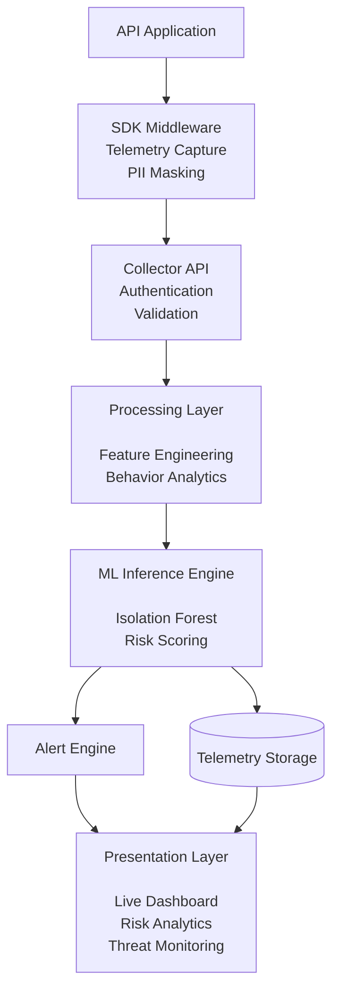

# API Security Analytics Dashboard — Final Project (Phases 1-3)

An end-to-end ML-driven API observability and security platform. This project detects zero-day API abuse, behavioral anomalies, and automated attacks using an unsupervised Machine Learning model (Isolation Forest) and investigates them automatically using Generative AI (Google Gemini 3.6-Flash).

## What's Included

This capstone project was completed in 3 distinct phases, moving from basic observability to autonomous AI investigation:

### Phase 1: The Telemetry Foundation
- **SDK**: A 3-line Flask middleware (`sdk/middleware.py`) that asynchronously captures API traffic (IP, latency, status codes, endpoints) without blocking the client response.
- **Collector**: A backend server (`backend/server.py`) that ingests telemetry via REST and stores it in SQLite.
- **Traffic Simulation**: Scripts (`demo/generators.py`) to simulate normal human traffic, brute-force logins, endpoint scanning (IDOR/reconnaissance), and burst scraping.
- **Live Dashboard**: A sleek, dark-themed UI (`dashboard/index.html`) polling every 3 seconds to show live streaming traffic.

### Phase 2: Unsupervised Machine Learning
- **Isolation Forest Model**: Replaced static, hard-coded rules (e.g., "block if requests > 50") with a Scikit-Learn `IsolationForest` model.
- **Behavioral Detection**: The model dynamically learns the "shape" of normal API traffic and flags behavioral deviations (high endpoint entropy, rapid bursts, unusual latency).
- **Dynamic Thresholds**: Calculates an anomaly score (0-10+). Scores > 5.0 are instantly flagged as `HIGH` severity alerts.

### Phase 3: GenAI Autonomous SOC Analyst
- **Gemini Integration**: Built a custom investigator agent (`backend/investigator.py`) using `google-genai`.
- **Context-Aware Prompting**: When an alert fires, the system automatically fetches the offending IP's chronological timeline from the database and builds a context-rich prompt.
- **Threat Intelligence Reports**: The GenAI model analyzes the traffic patterns, explains exactly *why* the ML model flagged it, and outputs actionable remediation steps (e.g., rate limiting, X-Forwarded-For inspection, WAF rules).
- **Inline UI**: Reports render instantly in a beautiful markdown modal directly within the live dashboard.

## Architecture Diagram



## Project Structure
```text
API-Security-Analytics-Dashboard/
├── backend/
│   ├── db.py                 # SQLite schema + storage layer
│   ├── detection.py          # ML scoring, feature extraction, alert fusion
│   ├── investigator.py       # Gemini GenAI Threat Analyst 
│   ├── train_model.py        # ML training script to fit Isolation Forest
│   ├── isolation_forest_model.joblib # Saved ML model
│   └── server.py             # Flask API backend (ingestion & dashboard API)
├── sdk/
│   └── middleware.py         # App instrumentation SDK
├── dashboard/
│   └── index.html            # Real-time frontend UI
├── demo/
│   ├── sample_app.py         # Mock vulnerable API service
│   └── generators.py         # Attack simulators
└── requirements.txt
```

## Setup & Installation

1. **Clone & Virtual Environment**
   ```bash
   python3 -m venv venv
   source venv/bin/activate
   pip install -r requirements.txt
   ```

2. **Set your API Key**
   You need a free Google AI Studio key for Phase 3 to work.
   ```bash
   export GEMINI_API_KEY="your_api_key_here"
   ```

## Running the Live Demo

You will need 3 terminal windows. Make sure your virtual environment is activated and your API key is exported in the first terminal!

**Terminal 1 — API Server (Collector & GenAI)**
```bash
source venv/bin/activate
export GEMINI_API_KEY="your_api_key_here"
python backend/server.py
```
> Open your browser to http://127.0.0.1:5001 to view the Live Dashboard.

**Terminal 2 — Sample Application (The Target)**
```bash
source venv/bin/activate
python demo/sample_app.py
```
> Note: Check if the sample app successfully started on port 5000 or 5002.

**Terminal 3 — Run Attacks**
```bash
source venv/bin/activate
python demo/generators.py all 
```

Watch the dashboard! The attacks will trigger the Machine Learning threshold, populating the Alerts panel. Click **Investigate** on any alert to generate an AI Threat Report.
