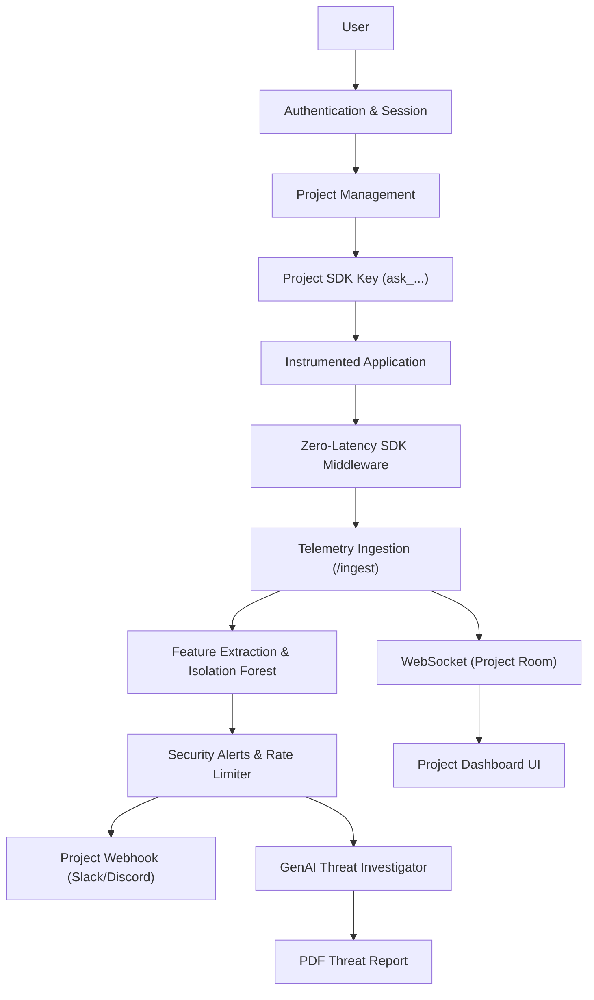

# 🛡️ API Security Analytics & Active Defense Platform

An end-to-end, zero-latency API observability, multi-tenant security, and autonomous active defense platform. This project detects zero-day API abuse, behavioral anomalies, and automated attacks using an unsupervised Machine Learning model (**Isolation Forest**). It actively defends servers via auto-blocking and webhooks, provides full multi-tenant project isolation with dedicated SDK credentials, and investigates threats autonomously using **Generative AI (Google Gemini)**.

---

## 🏗️ Architecture

```
User
 │
 ├── 1. Authentication (Signup / Login / Session)
 │
 └── 2. Project Selection (Multi-Tenancy)
      │
      ├── 3. SDK Credential (ask_<project_id>_<secret>)
      │    │
      │    └── Application (Flask / FastApi / Node)
      │         │
      │         └── SDK Middleware (Async Zero-Latency Telemetry)
      │              │
      │              └── 4. Telemetry Collector (/ingest)
      │                   │
      │                   ├── 5. ML Detection Engine (Isolation Forest + Heuristics)
      │                   │    │
      │                   │    └── 6. Alert & Active Defense (Auto-Block / Webhooks)
      │                   │         │
      │                   │         └── Slack / Discord Notification
      │                   │
      │                   └── 7. Real-Time WebSockets (Isolated Rooms)
      │                        │
      │                        └── 8. Project Dashboard (Live EKG, Maps, AI Investigations)
```

### Complete Pipeline Flow

```mermaid
flowchart TD
    User["User"] --> Auth["Authentication & Session"]
    Auth --> Project["Project Management"]
    Project --> SDKKey["Project SDK Key (ask_...)"]
    SDKKey --> App["Instrumented Application"]
    App --> SDK["Zero-Latency SDK Middleware"]
    SDK --> Collector["Telemetry Ingestion (/ingest)"]
    Collector --> ML["Feature Extraction & Isolation Forest"]
    ML --> Alerts["Security Alerts & Rate Limiter"]
    Alerts --> Webhook["Project Webhook (Slack/Discord)"]
    Collector --> WS["WebSocket (Project Room)"]
    WS --> Dashboard["Project Dashboard UI"]
    Alerts --> Gemini["GenAI Threat Investigator"]
    Gemini --> PDF["PDF Threat Report"]
```

---

## 🔐 Authentication & Session Security

The platform includes a complete, enterprise-grade authentication system designed to isolate user workspaces and enforce least privilege.

* **User Registration & Email Verification (`/api/auth/register`, `/api/auth/verify-email`, `/api/auth/resend-verification`):**
  * Validates RFC 5322 email syntax and prevents duplicate account registration (`HTTP 409 Conflict`).
  * Enforces minimum password strength requirements (≥ 8 characters) and password confirmation matching (`HTTP 400 Bad Request`).
  * Automatically provisions a default project workspace and initial SDK credentials upon registration.
  * Generates cryptographically secure, single-use email verification tokens (24-hour expiration) stored as SHA-256 hashes at rest.
  * Dispatches transactional verification emails via SMTP or dev mailbox fallback.
  * Google OAuth signups are automatically verified as email authenticity is verified by Google.
* **Secure Login (`/api/auth/login`):**
  * Verifies credentials against salted cryptographic hashes.
  * Prevents email enumeration attacks by returning uniform, generic error messages (`"Invalid email or password"`) for both non-existent accounts and invalid passwords.
  * Implements in-memory sliding-window brute force protection: 10 failed login attempts within 300 seconds trigger `HTTP 429 Too Many Requests`.
  * Records `last_login_at` timestamps upon successful authentication.
* **Forgot Password & Password Reset (`/api/auth/forgot-password`, `/api/auth/reset-password`):**
  * Initiates self-service password reset with uniform generic responses to defend against account enumeration.
  * Generates single-use, cryptographically random tokens valid for 1 hour, stored as SHA-256 hashes in the database.
  * Atomically validates token, updates password hash, marks token consumed, and touches `password_changed_at`.
  * Immediately invalidates all existing active sessions across all devices upon password reset.
* **Authenticated Password Change (`/api/auth/change-password`):**
  * Allows authenticated users to change their account password after validating their existing password.
  * Google-only accounts without an initial password can set an initial password without entering a current password.
  * Refreshes the active session's `auth_time` while immediately invalidating all other concurrent sessions.
* **Account Profile Management (`/api/auth/profile`):**
  * Retrieves unified account profile details: user ID, email, name, verification status, linked authentication identities (Password, Google), last login time.
  * Supports updating display name via `PUT /api/auth/profile`.
* **Session Management & Invalidation:**
  * Establishes server-side authenticated sessions stored in signed cookies.
  * Hardened with `HttpOnly` (mitigating XSS extraction), `SameSite=Lax` (mitigating CSRF), and a 7-day persistent lifespan.
  * Active sessions enforce session invalidation checks against `password_changed_at`. Any session created before the most recent password update is terminated with `401 Unauthorized`.
* **Google OAuth 2.0 / OpenID Connect (`/auth/google` & `/auth/google/callback`):**
  * One internal user architecture: Google OAuth resolves to the same internal user identity as email/password accounts.
  * Uses Google's stable OpenID subject identifier (`sub`) as `provider_user_id` in `auth_identities`, never the mutable email address.
  * Safe account linking: If a user with an existing email/password account clicks "Continue with Google" using that same email, the system safely requires password verification before linking the Google identity, preventing account takeover.
  * Once linked, the user can log in seamlessly using either method into the exact same workspace.
  * New Google users automatically receive an internal user ID, initial default project, and primary SDK credentials.
* **Logout (`/api/auth/logout`):**
  * Destroys session state immediately on the server and clears client session cookies.
* **Password Security:**
  * Passwords are securely hashed using Scrypt / PBKDF2 with unique salts via `werkzeug.security`.
  * Plaintext passwords and cryptographic hashes are never stored in plain text, logged, or exposed in API responses.
  * Google OAuth accounts created without a password store an unmatchable marker (`!oauth_provider`) ensuring password authentication cannot be forged or bypassed.

---

## 🏢 Multi-Tenant Projects

The platform supports true multi-tenancy: a single authenticated user can create and manage multiple isolated projects or API applications.

```
User (Ayush)
 ├── Project 1: E-Commerce API   ──> SDK Key A ──> Isolated Telemetry & Alerts
 ├── Project 2: Payment Gateway  ──> SDK Key B ──> Isolated Telemetry & Alerts
 └── Project 3: Internal Microservice ──> SDK Key C ──> Isolated Telemetry & Alerts
```

### Key Multi-Tenant Capabilities:
* **Project Creation:** Users can create custom projects with a name and optional description. Projects are assigned an immutable, unique ID (e.g., `proj_a1b2c3d4...`).
* **Tenant Isolation:** All database queries (`events`, `alerts`, `api_keys`, `webhook_configs`, `blocked_ips`) strictly enforce ownership server-side. Users cannot read, modify, or delete projects belonging to other accounts (IDOR-protected).
* **Project Switching:** The top navigation bar includes an interactive Project Selector. Switching projects dynamically updates:
  * Live telemetry event stream
  * Active security alerts & threat history
  * Attack charts, metrics, and top endpoints
  * Blocked IP addresses
  * SDK credentials and integration downloads
  * Webhook integrations

---

## 🔑 SDK Credentials & Security

Every project has its own dedicated SDK credentials used to authenticate telemetry.

### The Golden Rule:
> [!IMPORTANT]
> **The SDK credential is NOT the user's dashboard login token.**
> It contains zero user credentials, passwords, or dashboard session data. It is an isolated, scoped API key whose sole capability is authorizing background telemetry ingestion for that specific project.

* **Credential Format:** Recognizable, high-entropy tokens:
  ```text
  ask_<project_identifier>_<32_character_hex_secret>
  Example: ask_ecomm_a1b2c3d4e5f67890123456789abcdef0
  ```
* **Cryptographic Storage:** Only the `SHA-256` hash of the credential and its public prefix are stored in the database. Raw keys are shown only once upon generation.
* **Tenant Pinning:** When the ingestion collector receives telemetry with an SDK key, the server pins the `project_id` to the authenticated key owner. Even if a malicious payload submits a falsified `{"project_id": "other_project"}` in the request body, the server overrides it with the verified project identity.
* **Key Lifecycle Management:**
  * **Regenerate Key:** Issues a new credential and immediately revokes previous keys.
  * **Revoke Key:** Instantly invalidates the key. Ingestion requests using revoked keys immediately fail with `HTTP 401 Unauthorized`.
  * **Audit Timestamps:** Tracks `last_used_at` to monitor active data pipelines.

---

## 📦 SDK Integration Guide

Instrumenting any Python Flask API takes less than two minutes:

### Step 1: Create an Account & Project
1. Open the dashboard at `http://127.0.0.1:5001`.
2. Register an account and sign in.
3. Select an existing project or click **"+ New Project"**.

### Step 2: Download the Project SDK
1. Click the **"SDK Integration"** button in the dashboard header.
2. Review your project ID and active SDK credential.
3. Click **"Download SDK (.zip)"**. The backend generates a ready-to-run package tailored specifically for your project containing:
   * `middleware.py` — The asynchronous, non-blocking telemetry middleware.
   * `config.py` — Configured with your `PROJECT_ID`, `SDK_KEY`, and collector URL.
   * `sample_app.py` — A working example application.
   * `README.md` — Step-by-step instructions.

### Step 3: Add the SDK to Your Application
Extract the SDK into your API codebase and add 3 lines to your Flask application:

```python
from flask import Flask
from sdk.middleware import observe

app = Flask(__name__)

# Instrument your app (non-blocking background worker)
observe(
    app,
    collector_url="http://127.0.0.1:5001",
    token="ask_your_project_sdk_key_here"
)

@app.route("/api/checkout", methods=["POST"])
def checkout():
    return {"status": "success"}, 200

if __name__ == "__main__":
    app.run(port=5002)
```

### Step 4: Start Your Application
Run your API:
```bash
python app.py
```

### Step 5: Verify Live Telemetry
Make requests to your API. Telemetry immediately begins streaming into your project dashboard via WebSockets.

---

## 🔔 Project-Specific Slack & Discord Webhooks

Each project can have its own independent notification channel.

* **Per-Project Configuration:** Open **"Integrations"** from the dashboard to attach an incoming Slack or Discord webhook to the selected project.
* **Secret Protection:** Webhook URLs are secrets. The backend masks them in all UI views and API responses:
  ```text
  https://hooks.slack.com/services/****/****/****
  https://discord.com/api/webhooks/****/****
  ```
  Unauthenticated users or users from other tenants cannot view, test, or modify webhook configurations.
* **Interactive Testing:** Use the **"Test Webhook"** button in the modal to send a verified test alert directly to your security channel before going live.
* **Alert Isolation:** When a `HIGH` severity attack occurs (such as rapid brute-force or aggressive scanning), notifications are dispatched **strictly** to that project's webhook. No alerts leak across different projects.

---

## 🌟 Core Platform Features

### 1. Zero-Latency SDK (Telemetry)
* **Asynchronous Capture:** A lightweight Flask middleware (`sdk/middleware.py`) that hooks into any API. It extracts traffic data (IP, latency, endpoints, status codes) and forwards it to the collector via a background worker thread with internal queue buffering, ensuring **zero host API latency**.

### 2. Unsupervised Machine Learning (Detection)
* **Isolation Forest Model:** Dynamically detects behavioral anomalies without relying solely on static signatures.
* **Real-time Feature Extraction:** Analyzes rolling windows of failed authentications, endpoint entropy (scanning patterns), and request burst rates, outputting an Anomaly Risk Score from 0.0 to 10.0.

### 3. Active Defense & Alerting (Response)
* **Auto-Blocking / Rate Limiting:** Abusive IPs exceeding the rate threshold (>50 requests/min) are automatically intercepted and blocked (`429 Too Many Requests`) at the ingestion layer for 5 minutes.
* **Proactive UI Warnings:** Warns security operators via a glowing banner when an IP hits 30% of the threshold, enabling preemptive one-click manual blocking before the attack peaks.
* **Automated Webhooks:** `HIGH` severity incidents instantly notify Slack or Discord channels.

### 4. GenAI Threat Analyst (Google Gemini)
* **Autonomous Investigation:** Clicking "Investigate" on any alert feeds the exact 30 chronological events surrounding the attack into `gemini-3.6-flash`.
* **Actionable Intelligence:** Generates structured Threat Intelligence, ML Interpretations, and Remediation Strategies.
* **One-Click PDF Export:** Instantly exports the AI Threat Report to an executive-ready, formatted PDF document.

### 5. "Movie Hacker" Real-Time Dashboard (Observability)
* **WebSockets Integration:** Built with `Flask-SocketIO` to push live events and alerts to authenticated project rooms (`project_<id>`).
* **Smooth 1-FPS EKG Chart:** Batches real-time traffic updates into a fluid, animated Bezier curve with glowing plasma styling.
* **Interactive Time Windows:** Seamlessly switch between 30s, 1m, and 5m live telemetry views.
* **Live Threat Map:** Plots attacking IP geolocation dynamically on a dark-themed Leaflet.js world map.
* **Attack Distribution Chart:** Real-time Chart.js doughnut chart visualizing active threat proportions (Brute Force, Scan, Burst, ML Anomaly).
* **Historical Analytics Tab:** Inspect historical traffic distributions, top accessed endpoints, and top attacker IPs over selectable time ranges.

---

## 🛠️ Project Structure

```text
API-Security-Analytics-Dashboard/
├── backend/
│   ├── auth.py                 # User authentication, registration, hashing & decorators
│   ├── db.py                   # Multi-tenant SQLite database schema & queries
│   ├── detection.py            # ML scoring & Isolation Forest dynamic thresholding
│   ├── investigator.py         # Google Gemini GenAI threat investigation
│   ├── rate_limiter.py         # Ingestion rate limiter & login brute-force defense
│   ├── google_auth.py          # Google OAuth 2.0 / OpenID Connect client integration
│   ├── server.py               # Main Flask & SocketIO application server
│   ├── webhook.py              # Project-specific Slack/Discord notification dispatcher
│   ├── train_model.py          # Isolation Forest model training script
│   ├── test_auth_suite.py      # Comprehensive 260-test multi-tenant regression suite
│   ├── test_security_audit.py  # 86-test security audit verification suite
│   └── test_google_oauth_suite.py # 14-scenario Google OAuth verification suite
├── sdk/
│   └── middleware.py           # Zero-Latency asynchronous Python SDK
├── dashboard/
│   └── index.html              # Real-time cyberpunk dashboard & authentication UI
├── demo/
│   ├── sample_app.py           # Instrumented mock E-Commerce API (Port 5002)
│   └── generators.py           # Realistic attack & normal traffic simulation suite
├── .env.example                # Example environment configuration template
└── requirements.txt            # Python dependencies
```

---

## ⚙️ Environment Variables

Configure the following variables in your environment or `.env` file (see `.env.example`):

| Variable | Required | Default | Description |
| :--- | :---: | :---: | :--- |
| `GEMINI_API_KEY` | **Yes** (for AI) | None | Google AI Studio API key used for autonomous GenAI Threat Investigations. |
| `SECRET_KEY` | Recommended | `api-security-dashboard-secret-321` | Cryptographic secret for signing Flask session cookies. |
| `PORT` | Optional | `5001` | Port on which the central backend and dashboard listen. |
| `GOOGLE_CLIENT_ID` | Optional* | None | Google Cloud OAuth 2.0 Web Client ID (*required for Google sign-in). |
| `GOOGLE_CLIENT_SECRET` | Optional* | None | Google Cloud OAuth 2.0 Web Client Secret (*required for Google sign-in). |
| `GOOGLE_REDIRECT_URI` | Optional | `http://127.0.0.1:5001/auth/google/callback` | Authorized redirect URI for Google OAuth callback. |
| `SLACK_WEBHOOK_URL` | Optional | None | Optional global fallback webhook (projects configure their own webhooks in the UI). |

> [!NOTE]
> Do not commit real API keys or secrets to version control. Set them locally in your environment or export them in your terminal session.

---

## 🌐 Google Cloud OAuth 2.0 Configuration

To enable "Continue with Google" sign-in:

### 1. Create a Google Cloud Project & Configure Consent Screen
1. Navigate to the [Google Cloud Console](https://console.cloud.google.com/).
2. Create a new project (e.g. `ml-o11y-security-platform`) or select an existing one.
3. Go to **APIs & Services > OAuth consent screen**.
4. Choose **External** user type and click **Create**.
5. Fill in the required fields:
   * **App name:** `API Security Analytics Platform`
   * **User support email:** Your email address
   * **Developer contact information:** Your email address
6. In **Scopes**, click **Add or Remove Scopes** and select:
   * `.../auth/userinfo.email`
   * `.../auth/userinfo.profile`
   * `openid`
7. Complete the consent screen configuration.

### 2. Create OAuth 2.0 Credentials
1. Go to **APIs & Services > Credentials**.
2. Click **+ Create Credentials** and select **OAuth client ID**.
3. Set **Application type** to **Web application**.
4. Name: `ML-O11Y Web Client`.
5. Under **Authorized redirect URIs**, add:
   * **Local Development:** `http://127.0.0.1:5001/auth/google/callback`
   * **Production:** `https://your-production-domain.com/auth/google/callback`
6. Click **Create**. A modal will display your **Client ID** and **Client Secret**.

### 3. Configure the Application
Add the credentials to your environment or `.env` file:
```bash
export GOOGLE_CLIENT_ID="your-client-id.apps.googleusercontent.com"
export GOOGLE_CLIENT_SECRET="your-client-secret"
export GOOGLE_REDIRECT_URI="http://127.0.0.1:5001/auth/google/callback"
```

---

## 🚀 Setup & Installation

### 1. Clone & Set Up Python Environment

**Windows (PowerShell):**
```powershell
python -m venv .venv
.\.venv\Scripts\Activate.ps1
pip install -r requirements.txt
```

**macOS / Linux (Bash):**
```bash
python3 -m venv .venv
source .venv/bin/activate
pip install -r requirements.txt
```

### 2. Configure Environment Variables

**Windows (PowerShell):**
```powershell
$env:GEMINI_API_KEY = "your_google_ai_studio_api_key_here"
$env:SECRET_KEY = "your_secure_random_session_secret"
```

**macOS / Linux (Bash):**
```bash
export GEMINI_API_KEY="your_google_ai_studio_api_key_here"
export SECRET_KEY="your_secure_random_session_secret"
```

---

## 🎥 Running the Live Platform Demo

To run the complete interactive platform demonstration, open **3 terminal windows** (with your virtual environment activated in all three):

### Terminal 1 — The Security Brain & Dashboard
Runs the telemetry collector, ML engine, SQLite database, and real-time dashboard server:
```bash
python backend/server.py
```
* **Dashboard URL:** Open your browser to `http://127.0.0.1:5001`.
* **Login:** Sign up for a new account, or use the pre-seeded demo account:
  * **Email:** `demo@mlo11y.local`
  * **Password:** `demo123456`

### Terminal 2 — The Victim Application
Runs a sample e-commerce API (listening on port **5002**), instrumented with the SDK:
```bash
python demo/sample_app.py
```

### Terminal 3 — The Attack & Traffic Simulator
Simulates normal web visitors alongside automated hackers executing Brute Force logins, Endpoint Scans, and Request Bursts:
```bash
python demo/generators.py continuous
```

> **Watch the Live Defense:** Look at the dashboard on `http://127.0.0.1:5001`. Normal requests render as a smooth blue line. As soon as attack spikes occur, the ML engine raises alerts, the attacking IP is plotted on the world map, auto-blocking triggers (`429`), and you can click **"Investigate"** to receive a full Gemini AI threat analysis and PDF report!

---

## 🧪 Running Automated Test Suites

The repository contains comprehensive automated test suites covering authentication, IDOR authorization, SDK lifecycle, and security controls:

### Multi-Tenancy Regression Suite (260 Tests)
```bash
python backend/test_auth_suite.py
```

### Complete Security Audit Suite (86 Checks)
```bash
python backend/test_security_audit.py
```

### Google OAuth 2.0 / OpenID Connect Suite (14 Scenarios)
```bash
python backend/test_google_oauth_suite.py
```

### Production SaaS Authentication Suite (12 Scenarios)
```bash
python backend/test_saas_auth_suite.py
```

All suites execute cleanly with zero external mock services required.
